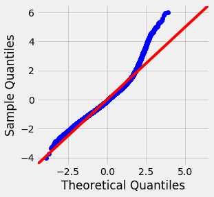
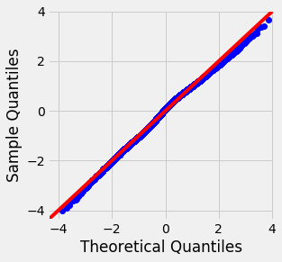

# Module 2 Final Project

#  Project Summary

style='font-family:Helvetica'> 
## Using the King County House Sales dataset, the client(a group of sellers) would like us to determine what factors drive the price of homes using multivariate regression analysis.  Based on the dataset we will review at least 3 meaningful questions about drivers of housing prices.  

## The Data
### We started with 19 features and price_est as the y_factor:

### id, date, price_est, bedrooms, beds_to_baths, sqft_living, sqft_lot, floors, waterfront, view, condition, grade, sqft_above, sqft_basement, yr_built, yr_renovated, zipcode, lat, long, sqft_living15, sqft_lot15.

### The data above was analyzed using the ols regression model with additional testing for multicolinearity, variable inflation, categorization, normality (log of y factor), and homoscedasticity.  Finally, the data was verified using a review of residuals, the train_test_split method and cross validation using sklearn.  Outliers were excluded using zscores so that the data went from 21597 to 18310 rows.  The final r2 was 40.1 and the data may be overfitted as seen by reviewing the homoscedasticity qq-plot. 

### None of the data elements were deemed to be normal from beginning to the end of the process.

### The results

### Much of the data was excluded from the anaylsis due to various factors as noted below:

* ### id, date were excluded because they were determined to be meaningless for this analysis.
* ### latitude, longitude and zipcode were excluded as they are more geospacial and should be evaluated in that manner.
* ### yr_renovated was dropped because it had over 95% zeroes meaning not enough values to analyze statistically
* ### Initial ols model showed 58.3 r2 and 3 items with p_values greater than .05.  The following columns were dropped: sqft_lot, sqft_above and sqft_basement

### sqft_lot15 and sqft_living15 were dropped due to multicolinearity
* ### baths_to_beds and grade were dropped due to variable inflation factor
* ### Remaining category columns were: bedrooms, floors and waterfront which were hot encoded
* ### Remaining numerical features were : sqft_living, viewed_by_buyer, condition and yr_built
### Checks for multicolinearity showed a couple of items that were colinear and needed to be dropped.

* ### These variable numerical features were reviewed again and found not to be normal
* ### The price_est(y_factor) was log transformed and the final ols model was run showing 40.2  r2
* ### The final qq graph shows that the data may be overfitted

* ### Residuals were analyzed and were not random
* ### Train_test_split and cross-validation support the 40.2 r2

### final coefficients were:
* #### Intercept                 1.969494e+01
* #### sqft_living               3.760559e-04
* #### floors                      1.823321e-01
* #### waterfront               7.570552e-16
* #### viewed_by_buyer   1.979407e-01
* #### condition                3.535024e-02
* #### yr_built                  -3.980883e-03

## Conclusion

### With the final r2 at 40.2 it is hard to make a statistical prediction for the remaining values.  They are probably directionally correct but shouldn't be used for actual prediction.  Lat, long and zipcode will be reviewed in tableau

!
